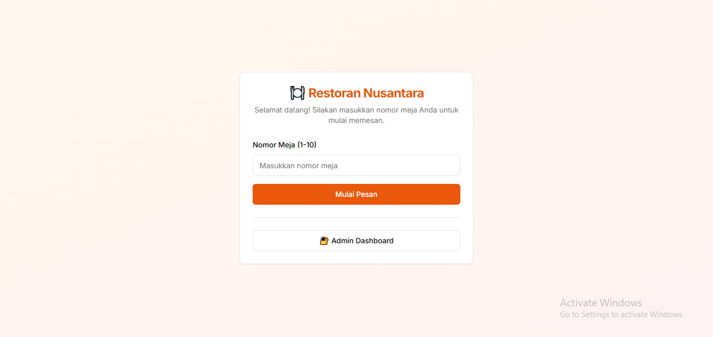

# 🍔 PesanAja - Project Lucu & Lezat!

> **⚠️ CATATAN: Project ini masih 100% BELUM SELESAI!**
> 
> Banyak fitur yang masih dalam pengembangan, jadi jangan heran kalau ada bug, error, atau fitur yang tiba-tiba hilang. Silakan bantu lanjutkan atau kasih saran ya! 😅




Selamat datang di **PesanAja**! Sistem kasir digital untuk restoran kekinian, biar orderan nggak nyasar ke meja sebelah dan chef nggak pusing lagi! 😆

---

## 🚀 Fitur Utama (Nanti Kalau Sudah Jadi)

- **Manajemen Menu**: Tambah, edit, hapus menu makanan & minuman favoritmu.
- **Manajemen Kategori**: Biar menu nggak campur aduk kayak salad buah.
- **Order System**: Pelanggan bisa pesan dari meja, pesanan langsung masuk ke dapur (dan ke dashboard admin).
- **Status Pesanan**: Pantau status pesanan dari "pending" ➡️ "cooking" ➡️ "completed" ➡️ "cancelled".
- **Dashboard Admin**: Lihat semua pesanan, update status, dan kelola menu dengan mudah.
- **Autentikasi Admin**: Biar yang bisa ngacak-ngacak menu cuma admin!

---

## 🧑‍🍳 Cara Menjalankan

1. **Clone repo ini**
   ```bash
   git clone <https://github.com/xfbriianto/PesanAja>
   cd restaurant-pos
   ```
2. **Install dependencies**
   ```bash
   cd backend && npm install
   cd ../frontend && npm install
   ```
3. **Setup Database**
   - Buat database MySQL: `restaurant_pos`
   - Jalankan semua file SQL di folder `backend/migrations/` secara berurutan.
   - (Opsional) Isi data awal menu, kategori, dan meja.
4. **Jalankan Backend**
   ```bash
   cd backend
   npm run dev
   # atau
   node server.js
   ```
5. **Jalankan Frontend**
   ```bash
   cd frontend
   npm run dev
   ```
6. **Buka di browser**
   - Pelanggan: [http://localhost:3000](http://localhost:3000)
   - Admin: [http://localhost:3000/admin](http://localhost:3000/admin)

---

## 📦 Struktur Folder

```
restaurant-pos/
  backend/    # Node.js + Express + MySQL
  frontend/   # Next.js (React)
```

---

## 🥗 Contoh Menu

| Nama           | Kategori        | Harga   |
|----------------|-----------------|---------|
| Nasi Goreng    | Makanan Utama   | 20.000  |
| Es Teh Manis   | Minuman         | 5.000   |
| Pisang Goreng  | Snack           | 10.000  |
| Brownies       | Dessert         | 15.000  |

---

## 🤖 Teknologi yang Digunakan

- **Backend**: Express, MySQL, JWT, bcrypt
- **Frontend**: Next.js, React, Tailwind CSS
- **ORM**: Manual Query (biar lebih greget)

---

## 🦄 Kenapa Harus Pakai Project Ini?

- Biar chef nggak salah masak pesanan meja 7 ke meja 13
- Admin bisa update menu tanpa ribet
- UI modern, UX ramah, dan... ada emoji lucu! 😋
- Bisa dikembangkan jadi sistem QR order, kitchen display, dan lain-lain

---

## 📸 Screenshot

)

---

## 📝 Kontribusi

Pull request, kritik, dan saran sangat diterima. Tapi jangan cuma ngasih saran, sekalian bawa makanan juga ya! 🍕

---

## ❤️ Happy Coding & Happy Cooking!

> "Makan enak, coding asik, hidup makin menarik!" 